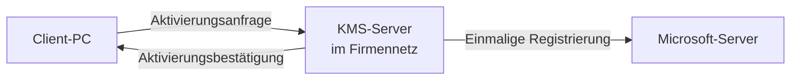
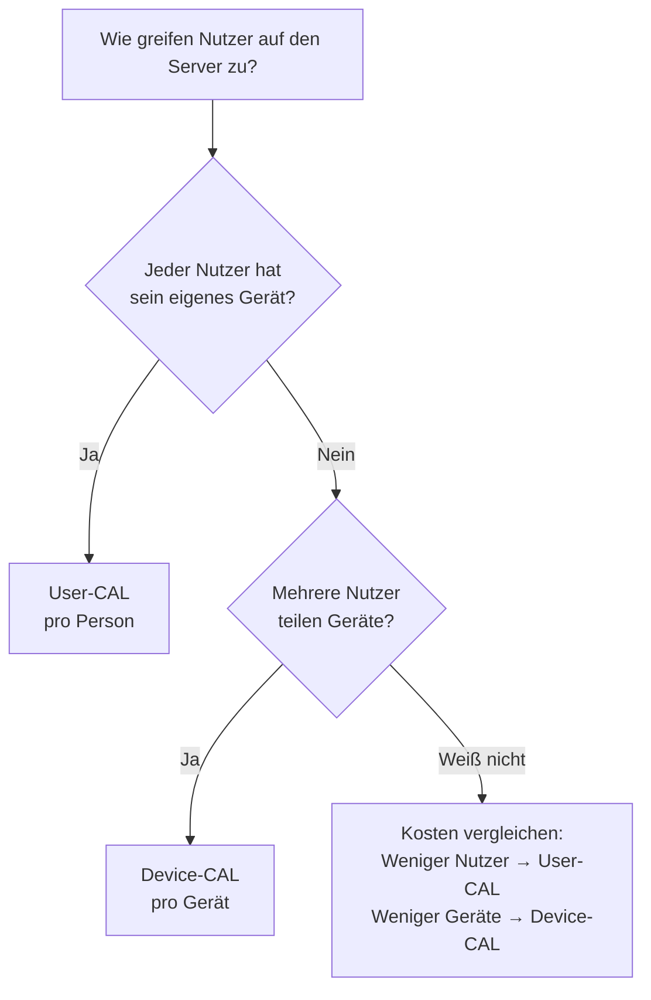

# Kapitel 2 – Unternehmenslizenzen

  

  

  

  

  

<h3>Was du heute lernst</h3>

- User-Lizenzen und Gerätelizenzen unterscheiden
- Named User License (NUL) erklären und einordnen
- Verstehen, wie die KMS-Aktivierung in Unternehmen funktioniert
- CAL-Lizenzen für Windows Server kennen und anwenden
- Lizenzbedarfe aus Unternehmensszenarien ableiten

---

## 2.1 User-Lizenzen vs. Gerätelizenzen

Im Unternehmensumfeld gibt es zwei grundlegende Konzepte, wie Software lizenziert werden kann:

### User-Lizenz (Nutzer-Lizenz)

Eine **User-Lizenz** ist an eine bestimmte **Person** gebunden. Der Nutzer darf die Software auf mehreren Geräten installieren – aber immer nur er selbst.

**Beispiel:** Eine Office-365-Lizenz für „Anna Müller". Anna darf Office auf ihrem Büro-PC, ihrem Laptop und ihrem Heimrechner nutzen – andere Mitarbeiter jedoch nicht.

### Geräte-Lizenz (Device License)

Eine **Geräte-Lizenz** ist an ein bestimmtes **Gerät** gebunden. Auf diesem Gerät dürfen beliebig viele Nutzer die Software verwenden – aber die Lizenz gilt nur für dieses eine Gerät.

**Beispiel:** Ein Kassensystem mit einer Gerätelizenz. Verschiedene Kassierer nutzen dasselbe Gerät – die Lizenz bleibt am Gerät.

!!! info "Wann welches Modell?"
    **User-Lizenz** eignet sich, wenn Mitarbeiter von mehreren Geräten aus arbeiten (z. B. Büro + Homeoffice).
    
    **Gerätelizenz** ist sinnvoll, wenn viele Personen dasselbe Gerät teilen (z. B. Schichtbetrieb, Kassensysteme).

---

## 2.2 Named User License (NUL)

Eine **Named User License** (NUL) ist eine spezifische Form der User-Lizenz. Sie ist **namentlich** einer konkreten Person zugeordnet und kann **nicht** auf andere übertragen werden, ohne einen formalen Verwaltungsprozess.

### Typische Einsatzbereiche

- SAP-Systeme (SAP Professional User License)
- Adobe Creative Cloud (pro Person)
- Spezialsoftware in der Buchhaltung oder im ERP-System

!!! warning "Häufiger Fehler"
    Eine NUL darf **nicht** geteilt werden. Wenn zwei Mitarbeiter sich einen Login teilen, um Lizenzkosten zu sparen, ist das eine **Lizenzverletzung** – auch wenn die Software technisch funktioniert.

---

## 2.3 KMS-Aktivierung

**KMS** steht für **Key Management Service**. Es ist eine Technologie von Microsoft, mit der große Unternehmen Windows und Office **zentral aktivieren** können – ohne dass jedes Gerät einzeln mit Microsoft kommunizieren muss.

### Wie funktioniert KMS?

1. Das Unternehmen richtet einen **KMS-Server** im internen Netzwerk ein
2. Jeder PC im Netzwerk aktiviert sich beim KMS-Server (nicht bei Microsoft direkt)
3. Der KMS-Server kommuniziert nur einmalig mit Microsoft
4. Die Aktivierung der Clients muss alle **180 Tage** erneuert werden – solange der KMS-Server erreichbar ist, geschieht das automatisch

### Voraussetzungen

- Mindestens **25 Clients** (Windows) oder **5 Clients** (Office) müssen den KMS-Server kontaktieren, damit er aktiv wird
- Der PC muss sich mindestens alle 180 Tage im Firmennetz einloggen (oder per VPN)

!!! tip "Praktische Relevanz"
    Im Unternehmensalltag wirst du oft KMS-aktivierte Windows-Installationen sehen. Erkennbar daran, dass die Aktivierung im Firmennetz automatisch klappt, aber ohne Netzwerkanschluss eine Warnung erscheint.

---

## 2.4 CAL-Lizenzen für Windows Server

**CAL** steht für **Client Access License** – eine Zugriffslizenz für Windows Server.

Wenn Mitarbeiter auf einen Windows Server zugreifen (z. B. für Dateifreigaben, Drucker, Active Directory), benötigt **jeder Zugreifende** eine CAL – zusätzlich zur Server-Lizenz selbst.

!!! info "Wichtig"
    Die Windows-Server-Lizenz erlaubt den **Betrieb** des Servers. Die CAL erlaubt den **Zugriff** auf den Server. Beides wird benötigt!

### Die zwei CAL-Typen

#### User-CAL

Eine User-CAL ist an eine **Person** gebunden. Der Nutzer darf von beliebig vielen Geräten aus auf den Server zugreifen.

**Wann sinnvoll?** Wenn Mitarbeiter von mehreren Geräten aus zugreifen (PC + Laptop + Terminal).

#### Device-CAL

Eine Device-CAL ist an ein **Gerät** gebunden. Vom diesem Gerät aus darf eine beliebige Anzahl von Nutzern auf den Server zugreifen.

**Wann sinnvoll?** Wenn viele Mitarbeiter dasselbe Gerät nutzen (z. B. Schichtarbeit, Produktionsrechner).

### Entscheidungsdiagramm

---

## Aufgaben – Kapitel 2

{{ task(file="tasks/tag2_01.yaml") }}

{{ task(file="tasks/tag2_02.yaml") }}

{{ task(file="tasks/tag2_03.yaml") }}

{{ task(file="tasks/tag2_04.yaml") }}

{{ task(file="tasks/tag2_05.yaml") }}
