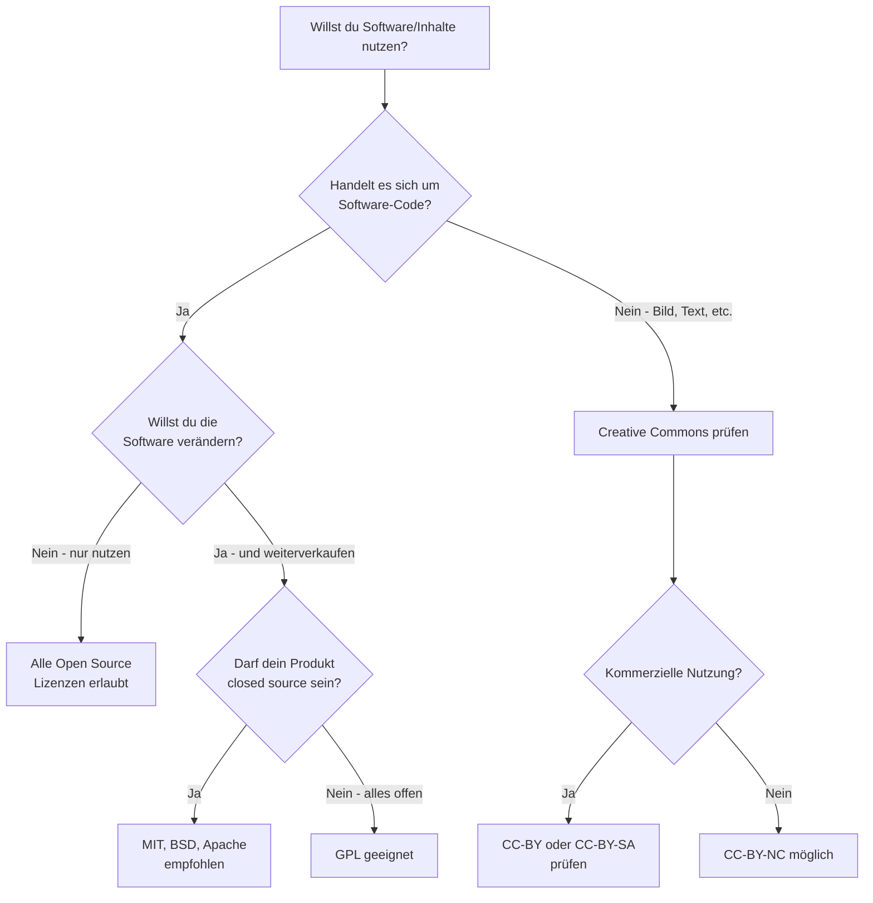

# Kapitel 3 – Open Source Lizenzen

  

  

  

  

  

<h3>Was du heute lernst</h3>

- Verstehen, was „Open Source" bedeutet – und was es nicht bedeutet
- GNU GPL, LGPL und AGPL unterscheiden (Copyleft-Prinzip)
- Die MIT-Lizenz als permissives Modell erklären
- Creative Commons Varianten kennen und anwenden
- Die Unterschiede zwischen Open-Source-Lizenzen auf Praxisfälle übertragen

---

## 3.1 Was ist Open Source?

„Open Source" bedeutet wörtlich: **offener Quellcode**. Das heißt, der Programmiercode ist öffentlich einsehbar. Aber Open Source bedeutet **nicht** automatisch „kostenlos" oder „darf man alles damit machen".

!!! info "Wichtige Unterscheidung"
    **Freeware** = kostenlos nutzbar, Quellcode meist nicht einsehbar  
    **Open Source** = Quellcode einsehbar, darf verändert werden – aber **unter bestimmten Bedingungen**  
    **Public Domain** = keinerlei Einschränkungen, vollständig frei

Die genauen Bedingungen legt die **Lizenz** fest. Verschiedene Open-Source-Lizenzen haben unterschiedliche Regeln.

### Die vier Freiheiten (Free Software Foundation)

1. Die Software für jeden Zweck **nutzen**
2. Den Quellcode **studieren** und verstehen
3. Die Software **weitergeben**
4. Die Software **verändern** und verbesserte Versionen weitergeben

---

## 3.2 GNU GPL – Copyleft-Prinzip

**GNU GPL** steht für **GNU General Public License**. Sie ist die bekannteste Open-Source-Lizenz mit einem starken **Copyleft**-Prinzip.

### Was bedeutet Copyleft?

Copyleft bedeutet: Wenn du Software unter der GPL nimmst, veränderst und weitergibst, **muss deine Weiterentwicklung ebenfalls unter der GPL stehen**. Der offene Charakter „vererbt" sich.

!!! warning "Wichtig für Unternehmen"
    Wenn du GPL-Software in ein kommerzielles Produkt einbaust, das du verkaufst, musst du deinen **gesamten Quellcode** ebenfalls unter der GPL veröffentlichen. Das ist für viele Unternehmen ein Problem.

### GPL-Varianten

| Variante | Vollname | Besonderheit |
|---|---|---|
| **GPL v2/v3** | GNU General Public License | Starkes Copyleft, gesamter Code muss offen sein |
| **LGPL** | GNU Lesser GPL | Schwächeres Copyleft – darf als Bibliothek in proprietäre Software eingebaut werden |
| **AGPL** | Affero GPL | Wie GPL, aber auch für Netzwerkdienste (z. B. Web-Apps) |

**Bekannte GPL-Software:** Linux-Kernel (GPL v2), WordPress (GPL v2), VLC Media Player (GPL v2)

---

## 3.3 MIT-Lizenz – maximale Freiheit

Die **MIT-Lizenz** ist eine **permissive** (erlaubende) Open-Source-Lizenz. Sie hat kaum Einschränkungen.

### Was darf man mit MIT-Software?

- Nutzung für jeden Zweck (auch kommerziell)
- Verändern und in eigene Software einbauen
- Weitergeben – auch als proprietäre (geschlossene) Software
- Verkaufen

### Was muss man beachten?

- Der ursprüngliche **Copyright-Hinweis** muss erhalten bleiben
- Der **Lizenztext** muss in der Software oder Dokumentation enthalten sein

Das ist alles. Deswegen ist MIT eine der beliebtesten Lizenzen im Unternehmensumfeld.

**Bekannte MIT-Software:** React (Facebook/Meta), Node.js, jQuery, Ruby on Rails

!!! tip "Merkregel"
    MIT = Mach damit was du willst, aber vergiss nicht, wer es geschrieben hat.

---

## 3.4 Creative Commons

**Creative Commons (CC)** ist kein einzelne Lizenz, sondern ein **System von Lizenzbausteinen** – ursprünglich für kreative Werke (Texte, Bilder, Musik, Videos), zunehmend auch für Daten.

### Die vier Bausteine

| Kürzel | Symbol | Bedeutung |
|---|---|---|
| **BY** | :fontawesome-regular-copyright: | Attribution – Urheber muss genannt werden |
| **SA** | :material-autorenew: | ShareAlike – Abgeleitetes Werk muss gleiche Lizenz haben |
| **NC** | :fontawesome-solid-dollar-sign: (durchgestrichen) | NonCommercial – Keine kommerzielle Nutzung |
| **ND** | :material-pencil-off: | NoDerivatives – Keine Bearbeitungen erlaubt |

### Die häufigsten CC-Lizenzen

| Lizenz | Erlaubt | Einschränkungen |
|---|---|---|
| **CC0** | Alles – wie Public Domain | Keine |
| **CC-BY** | Alles, auch kommerziell | Urheber nennen |
| **CC-BY-SA** | Alles, auch kommerziell | Urheber nennen, gleiche Lizenz |
| **CC-BY-NC** | Nutzung & Veränderung | Nur nicht-kommerziell, Urheber nennen |
| **CC-BY-NC-SA** | Nutzung & Veränderung | Nicht-kommerziell, gleiche Lizenz |
| **CC-BY-ND** | Nutzung, keine Veränderung | Unverändert, Urheber nennen |

### Beispiel

Ein Fotograf lädt ein Bild unter **CC-BY-NC** hoch. Ein Schulbuch-Verlag darf es kostenlos nutzen, wenn er den Fotografen nennt. Ein Werbeagentur darf es **nicht** verwenden (kommerziell).

---

## 3.5 Lizenz-Vergleich auf einen Blick

---

## Aufgaben – Kapitel 3

{{ task(file="tasks/tag3_01.yaml") }}

{{ task(file="tasks/tag3_02.yaml") }}

{{ task(file="tasks/tag3_03.yaml") }}

{{ task(file="tasks/tag3_04.yaml") }}

{{ task(file="tasks/tag3_05.yaml") }}
