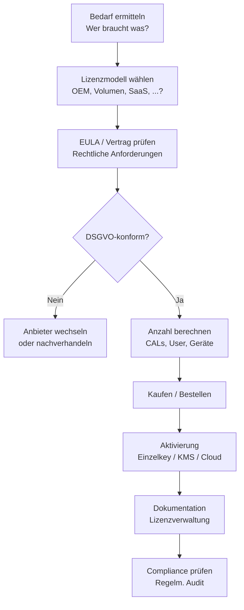

# Kapitel 5 – Fallstudien & Abschluss

  

  

  

  

  

<h3>Was du heute lernst</h3>

- Alle Lizenzmodelle und Rechtsgrundlagen in komplexen Praxisszenarien anwenden
- Einen Software-Beschaffungsprozess unter Berücksichtigung der Lizenzierung planen
- Compliance-Anforderungen im IT-Alltag einschätzen
- Den gesamten Kursinhalt in einer Abschlussaufgabe verknüpfen

---

## 5.1 Software-Beschaffung in Unternehmen

Wenn ein Unternehmen Software kaufen will, ist Lizenzierung nur ein Teil des Prozesses. Der komplette Beschaffungsprozess sieht typischerweise so aus:

### Lizenzverwaltung

Ein häufig unterschätzter Punkt: Lizenzen müssen **dokumentiert** und **verwaltet** werden. In der Praxis nutzen Unternehmen dafür:

- Einfache Tabellen (Excel / LibreOffice Calc)
- Spezialisierte Software wie **OPSI**, **Snipe-IT** oder **Microsoft VLSC**
- Teil des **IT-Asset-Managements (ITAM)**

---

## 5.2 Compliance und Lizenz-Audits

Ein **Lizenz-Audit** ist eine Prüfung, ob ein Unternehmen seine Software ordnungsgemäß lizenziert hat. Hersteller wie Microsoft, Adobe oder SAP können solche Audits durchführen oder ankündigen.

!!! warning "Was passiert bei Unter-Lizenzierung?"
    Wenn ein Unternehmen weniger Lizenzen hat als tatsächlich genutzte Installationen, spricht man von **Unter-Lizenzierung**. Die Konsequenzen:
    
    - Sofortige Nachzahlung für alle fehlenden Lizenzen
    - Strafzuschläge (oft 20–50% auf den Listenpreis)
    - Vertragsstrafen
    - Im Extremfall: Klage wegen Urheberrechtsverletzung

### Typische Audit-Fallen

| Falle | Problem |
|---|---|
| OEM-Lizenzen auf neuem PC | Lizenz erlischt, neue Hardware braucht neue Lizenz |
| Mitarbeiter ausgeschieden | NUL muss deaktiviert werden, nicht weiter genutzt |
| Testversion als produktiv genutzt | Testlizenzen haben oft ein Ablaufdatum |
| Cloud-Dienste ohne Audit | SaaS-Nutzung ohne Nachverfolgung aktiver User |

---

## 5.3 Gesamtübersicht aller Lizenzmodelle

| Modell | Bindung | Typisch bei | Übertragbar |
|---|---|---|---|
| OEM | Hardware | PC-Kauf | Nein |
| Volumenlizenz | Unternehmen | Größere Firmen | Ja (intern) |
| User-Lizenz (NUL) | Person | ERP, Adobe, MS365 | Nein (ohne Prozess) |
| Gerätelizenz | Gerät | Shared Terminals | Nein |
| KMS-Aktivierung | Firmennetz | Windows Enterprise | – |
| User-CAL | Person | Windows Server Zugriff | Nein |
| Device-CAL | Gerät | Shared Server Access | Nein |
| GNU GPL | – | Open Source, Entwicklung | – (Copyleft) |
| MIT | – | Open Source, permissiv | – |
| Creative Commons | – | Medien, Texte, Daten | – |

---

## Aufgaben – Kapitel 5

{{ task(file="tasks/tag5_01.yaml") }}

{{ task(file="tasks/tag5_02.yaml") }}

{{ task(file="tasks/tag5_03.yaml") }}

{{ task(file="tasks/tag5_04.yaml") }}

{{ task(file="tasks/tag5_05.yaml") }}

---

## Gut gemacht!

Du hast den Kurs **M1.9 – Lizenzierungsarten** abgeschlossen.

<h3>Was du jetzt kannst</h3>

- OEM, Volumen, NUL, KMS und CAL unterscheiden und situationsgerecht empfehlen
- Open-Source-Lizenzen (GPL, MIT, CC) erklären und auf Code-Projekte anwenden
- Ein EULA kritisch lesen und rechtliche Risiken einschätzen
- Urheberrecht, Markenrecht und Copyright voneinander abgrenzen
- Einen Lizenzierungs-Beschaffungsprozess strukturiert planen

